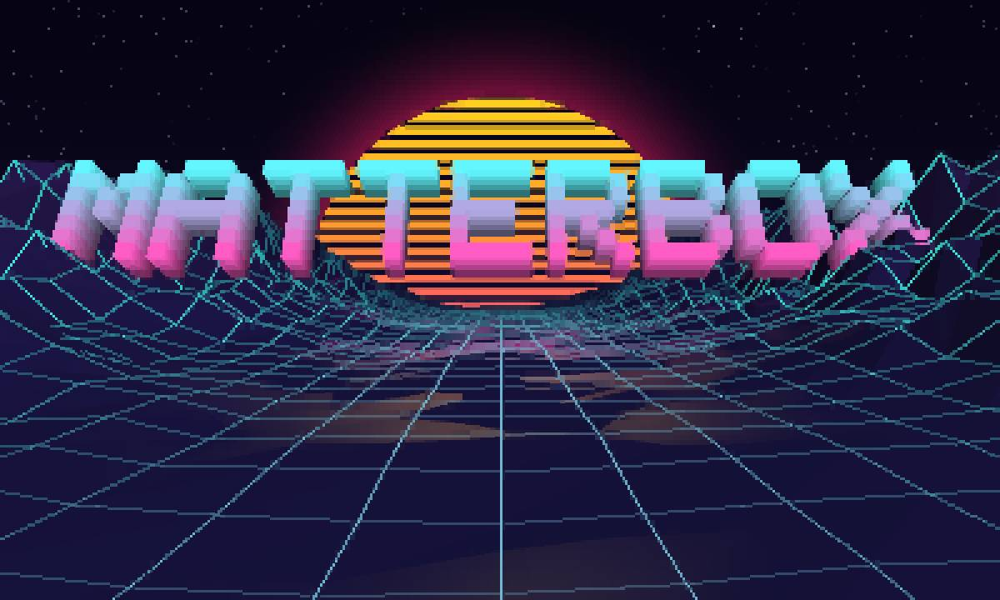

# matterbox



A fast terminal client for [Mattermost](https://mattermost.com) — a full TUI plus a
scriptable CLI, with a local message cache and optional AI features powered by a
local LLM.

## Features

- **Terminal UI** — teams, channels, DMs, threads, reactions, attachments, and
  live updates over WebSocket, built on [Bubble Tea](https://github.com/charmbracelet/bubbletea).
- **Scriptable CLI** — read, send, and search Mattermost from the shell or scripts,
  with `--json` output on most commands and shell completion for zsh/bash/fish.
- **Local message cache** — every message you see is stored in a local SQLite
  database (`~/.config/matterbox/messages.db`) so reopening a channel is instant
  and history is searchable offline. An optional read-only **SQL tab**
  (`sql_tab: true`) lets you query it directly — see [docs/database.md](docs/database.md).
- **Full-text search** — keyword search over the local cache via SQLite FTS5,
  available both in the TUI and as `matterbox search`.
- **Semantic search** — optional vector search over your message history using a
  local embeddings model (no data leaves your machine). Blended with keyword
  results via hybrid ranking.
- **Feed tab** — aggregated view of all unread messages across channels and DMs,
  excluding muted channels — press `M` (or set `feed_show_muted: true`) to let
  them in, sorted below everything else.
- **Pins, saved messages, templates** — pin or save a message and browse the
  saved ones, keep composer templates (`/tmpl`), pick a kaomoji, all from the
  command palette (`ctrl+p`, then `>`). Slash commands autocomplete their
  argument too, so `/kaomoji ` lists the faces and `/tmpl ` your templates.
- **Jira integration** — press `v` on a Jira issue link to open a side panel; edit
  Status, Priority, Story points, and Assignee inline without leaving the TUI.
- **GitLab integration** — press `v` on a GitLab MR link to open a merge-request
  side panel with pipeline, approvals, and status; approve or merge inline.
- **AI summaries** — summarize a channel or thread with a local LLM (Ctrl+K in the TUI).
- **Agentic search** — end a query with `?` on the Search tab and a local model
  uses tools to dig through your channels to answer it.
- **Clipboard paste** — paste images and files from the clipboard directly into
  the composer (macOS and Linux with wl-clipboard/xclip).
- **Drag and drop** — drag a file onto the terminal and it's attached. Terminals
  have no drag-and-drop protocol — they deliver a drop by pasting the file's
  path — so a paste that is nothing but existing file paths becomes an
  attachment (`attach_on_drop: false` to paste such paths as text instead).
- **Per-channel drafts** — unsent composer text is saved per channel via
  Mattermost's server-side drafts API, so each channel keeps its own draft,
  switching channels never loses what you typed, and a draft started here shows
  up (and stays in sync) in the webapp, mobile, and across restarts.
- **Nested replies** — press `r` on a reply and the thread pane draws a tree
  instead of Mattermost's flat list; other clients still see a normal reply.
- **Rules engine** — make the `listen` daemon react to what happens on your
  server: match on team/channel/author/text/mention and run actions (notify, run
  a local command, POST a webhook, post a message back, react, mark read).
  Rules can trigger on new messages, edits, deletions, reactions — or on the
  clock (`cron: "0 9 * * 1-5"`). `matterbox rules test` says which rules a
  message would fire and why the rest wouldn't. The Telegram bridge is itself
  just the default rule. See [docs/rules.md](docs/rules.md).

The AI features (summaries, semantic/agentic search) are entirely optional and talk
to any OpenAI-compatible endpoint — point them at a local
[llama.cpp](https://github.com/ggml-org/llama.cpp) server, or leave them off.

## Requirements

- Go 1.26+
- A Mattermost server and an account on it
- *(optional, for AI features)* a local OpenAI-compatible LLM server, e.g. llama.cpp

## Build & install

```sh
make            # build ./matterbox
make install    # build + install to ~/.local/bin and set up shell completion
make run        # build and launch the TUI
```

Optional features (the `--demo` soundtrack, inline video playback) need C
libraries; `make` detects what your machine has and compiles in whatever it
can, so a plain `make install` is all anyone needs. `make tags` shows what was
picked and how to unlock the rest (e.g. install `ffmpeg-devel` / `libav*-dev`
for video, then rebuild). Force a set with `make build TAGS=…` (`TAGS=` for
none).

Two caveats if you plan to *hand someone* a binary you built, rather than just
run it yourself:

- `-tags demoaudio` links `github.com/gotracker/opl2` (a GPL-2.0-or-later port
  of DOSBox's OPL synth) by way of the tracker library's core packages, so a
  demoaudio build is only distributable under the GPL — never under matterbox's
  Apache-2.0. That one is unavoidable: it comes from the dependency graph.
- `-tags video` links your system's FFmpeg, and *that* depends on how your
  FFmpeg was configured. Plain LGPL FFmpeg is fine to ship alongside
  Apache-2.0; one built `--enable-gpl` (which most distro builds are, because
  it enables x264 and friends) is not. So the same commit yields a
  distributable binary on one machine and a non-distributable one on another.
  `matterbox --version` asks the linked library and tells you which you have.

Build tag-free for anything you share — that is what the release binaries are.
`make third-party-licenses` writes the license bundle for a build and refuses to
produce one for a build it can't vouch for, checking both the Go dependency
graph and the linked FFmpeg.

Or with plain Go (no optional features, no cgo needed):

```sh
go build -o matterbox .
```

Every release also ships prebuilt Linux and macOS binaries (amd64 + arm64) on
the [releases page](https://github.com/cornedor/matterbox/releases) — pure Go,
so they need no toolchain, but they carry neither optional feature. Drop one in
`~/.local/bin` and run `matterbox welcome`.

`matterbox --version` names the build, the optional features it was compiled
with, and the platform — worth pasting into a bug report.

## Configure & log in

### Setup tool (recommended)

Run the interactive wizard to set server URL, log in, and pick basic preferences:

```sh
matterbox welcome
```

`matterbox login` opens your browser for GitLab SSO and saves the token to
`~/.config/matterbox/mm_token.json`. It hands the token back via an `mmauth://`
link. On **Linux** matterbox registers itself as the handler so the capture is
automatic; elsewhere, copy the link from the success page and paste it at the
prompt. `--show` prints the token path; `--clear` deletes it.

(Or put any valid session token in that file as `{"token": "..."}`.)

Running `matterbox` with no arguments launches the wizard automatically on first
run.

### Manual configuration

Edit `~/.config/matterbox/config.yaml` directly for full control. At minimum:

```yaml
server_url: https://mattermost.example.com
```

Then run `matterbox login` or place a token in `~/.config/matterbox/mm_token.json`
manually.

Set `MATTERBOX_CONFIG_DIR` to keep all of it (config, token, message cache,
stats) somewhere else — handy for a second profile.

## CLI

Running `matterbox` with no arguments launches the TUI — or, on a first run with
no saved login, the setup wizard. The subcommands are for setup and scripting:

| Command | What it does |
|---|---|
| `matterbox welcome` | Run the first-run setup wizard: server URL, sign-in, a few preferences |
| `matterbox login` | Sign in and save the session token — GitLab SSO, or `--password` |
| `matterbox send <channel> [message]` | Post a message (`--file` to attach, repeatable) |
| `matterbox reply <message-id> [message]` | Reply in a message's thread, recording which message you answered |
| `matterbox react <message-id> <emoji>...` | Add one or more emoji reactions to a message |
| `matterbox read [channel]` | Print recent messages (`--since`, `--until`, `--from`, `--thread`, `--wait`, `--json`) |
| `matterbox unread` | List unread messages grouped by channel (`--muted`, `--wait`, `--json`) |
| `matterbox mark-read <channel>...` | Mark one or more channels/DMs as read (clear unread) |
| `matterbox open <channel>` | Jump the running TUI to a channel or DM (used by notification clicks) |
| `matterbox search <query>` | Search the local cache (`--semantic`, `--channel`, `--context`, `--json`) |
| `matterbox channels` | List all teams and channels with their addresses (`--json`) |
| `matterbox digest` | Show your own recent messages in a time range (`--since`, `--until`, `--json`) |
| `matterbox whoami` | Print the authenticated user |
| `matterbox embed` | Backfill semantic-search embeddings for cached messages |
| `matterbox listen` | Background daemon: keeps cache warm and bridges @mentions/DMs to Telegram |
| `matterbox rules` | Inspect, list, and test the `listen` rules (`test`, `list`, `stats`, `state`) |
| `matterbox keys` | List all keyboard actions, default keys, and your config overrides |
| `matterbox decode [body]` | Show the hidden payload a matterbox post carries (`--post <id>` fetches it) |

Channels are addressed as `team/channel` (e.g. `eng/general`) or `@username` for a DM.

## Keybindings

The footer shows the primary keys for whatever has the keyboard — the focused
pane, or the modal on top of it. `?` expands it into every key that works right
now, grouped by layer; `f1 › Keys` opens the complete, scrollable cheatsheet of
your effective bindings (`matterbox keys` prints the same list). Three knobs
under `keybindings:` in `config.yaml` tune them:

```yaml
keybindings:
  nav_modifier: ctrl     # modifier for arrow-key team/channel nav:
                         # ctrl (default), alt, shift, super (⌘ / Windows;
                         # also "cmd"), meta, hyper, or none. On macOS ctrl+arrows
                         # clash with Mission Control — try shift, or super on a
                         # Kitty-protocol terminal (Ghostty/kitty/WezTerm).
  vim_nav: global        # when ctrl+h/j/k/l switch team/channel:
                         #   global  — from any focus, even while typing (default)
                         #   reading — only outside text inputs, so ctrl+h / ctrl+k
                         #             stay as the composer's emacs editing keys
                         #   off     — never (arrow nav still works in every mode)
  bindings:              # rebind individual actions (optional)
    compose: [i, a]      # a single key or a list
    delete_post: shift+d
    quit: []             # empty list (or "none") unbinds — ctrl+c always quits
    channel_next: ctrl+j # rebinding a nav action drops its modifier-arrow alias too
```

Each `bindings:` value names an **action** (`compose`, `channel_next`,
`delete_post`, …) and the key or keys that trigger it. Modifiers are
`ctrl`/`alt`/`shift`/`super`/`meta`/`hyper`. An unknown action id, an
unparseable chord, or a binding that would collide with another action is
reported as a startup error (with the full list of valid action ids), so a
typo fails loud rather than silently shadowing a key.

> Some chords only arrive on terminals that speak the Kitty keyboard protocol
> (Ghostty, kitty, WezTerm). `shift+enter` for example *sends* the message on a
> legacy terminal instead of inserting a newline — use `alt+enter` there.

## Jira, GitLab & GitHub integration (optional)

Press `v` on a message that names a Jira issue or links a GitLab merge request /
GitHub issue or pull request to open it in a side panel — read-only by default,
with inline editing/actions when the token allows it. All are opt-in and
configured in `config.yaml`. GitLab and GitHub share one forge panel and one
inline badge path; only the API client differs. GitHub issues are read-only in
the panel (approve/merge apply to pull requests only).

### GitLab

```yaml
gitlab:
  base_url: https://git.example.com
  token: glpat-…            # optional — see fallbacks below
```

`token` may be a **personal access token** or a **project access token**, with
these scopes:

| Scope | Covers |
|---|---|
| `read_api` | Everything read-only: the MR panel, inline `!iid` badges, pipeline/stage status, approval state. |
| `api` | The above **plus** the approve and merge actions. GitLab has no narrower scope for MR writes (`write_repository` is git-over-HTTPS only and does **not** cover the MR API). |

Use `read_api` unless you actually approve/merge from the TUI. If `token` is left
empty, matterbox falls back to the `GITLAB_TOKEN` env var, then to an existing
`glab` login (the token `glab auth login` stored for this host in
`~/.config/glab-cli/config.yml`) — so a working `glab` setup needs no secret in
this file.

### GitHub

```yaml
github:
  base_url: https://github.com   # optional; this is the default
  token: ghp-…                   # optional — see fallbacks below
```

Auth mirrors GitLab: prefer a PAT in config, otherwise reuse what you already
have. Resolution order (env overrides config, like `GITLAB_TOKEN`):

1. `GITHUB_TOKEN` or `GH_TOKEN` env var
2. `github.token` in config
3. An existing `gh auth login` for this host (`~/.config/gh/hosts.yml`)
4. Optional matterbox OAuth token from `matterbox github login` (device flow)

So a working `gh` setup needs no secret in this file. Device-flow OAuth is an
alternative when you don't use the GitHub CLI — it needs an OAuth App
`client_id` (`github.client_id` or `GITHUB_CLIENT_ID`) and:

```bash
matterbox github login
```

### Jira (Cloud only)

```yaml
jira:
  base_url: https://your-instance.atlassian.net
  email: you@example.com
  api_token: …             # or the JIRA_API_TOKEN env var
  projects: [ABC, PROJ]    # optional: enable bare-id detection (ABC-123)
```

Authentication is HTTP Basic with your Atlassian account email + an API token
(id.atlassian.com → Security → API tokens). What you need depends on the **kind**
of token:

- **Classic API token** (the default) — unscoped; it acts as your user, so access
  is gated by your Jira **project permissions**, not token scopes. *Browse
  Projects* is enough to view; *Transition Issues*, *Assign Issues*, and *Edit
  Issues* enable the inline status / assignee / priority / story-points edits.
- **Scoped API token** (the newer option) — select `read:jira-work` and
  `read:jira-user` for viewing, and add `write:jira-work` for the inline edits.

This integration targets Jira **Cloud** — it uses the `/rest/api/3` endpoints, so
Server/Data Center instances won't work as-is.

## AI features (optional)

Summaries and search use OpenAI-compatible endpoints configured under `summary`,
`ai_search`, and `embeddings` in `config.yaml` (defaults assume a local llama.cpp on
`127.0.0.1:8321` for chat and `:8322` for embeddings). A helper script for the
embeddings server is in [`scripts/llama-embeddings.sh`](scripts/llama-embeddings.sh).

Once an embeddings server is running, build the index with `matterbox embed` (or let
the TUI index in the background), then search with `matterbox search --semantic`.

## listen daemon (optional)

`matterbox listen` holds a persistent WebSocket connection to your Mattermost
server and writes every incoming message into the local cache — so the TUI
reopens warm and `search`/`digest` stay fresh without launching the UI.

When configured, it also bridges your @mentions and DMs to Telegram, optionally
summarising the surrounding conversation via the chat model first. Two-way mode
lets you reply from Telegram back into Mattermost. The daemon also accepts `/ask`
commands from Telegram to run agentic search against your message history.

It stays quiet about whatever you're reading: before notifying it asks the TUI
on this machine what's on screen, and skips the push if that channel is open in
a focused window. Rules gate on the same thing with
[`viewing: false`](docs/rules.md#not-while-youre-reading-it).

Run it under a process supervisor. `make install` drops a disabled service for
your platform:

```sh
# Linux (systemd --user)
systemctl --user enable --now matterbox-listen.service
journalctl --user -u matterbox-listen -f

# macOS (launchd)
launchctl bootstrap gui/$(id -u) ~/Library/LaunchAgents/com.matterbox.listen.plist
tail -f ~/Library/Logs/matterbox-listen.log
```

Configure under the `telegram` and `listen` sections in `config.yaml`
(set `telegram.bot_token` from @BotFather and `telegram.chat_id`). The daemon is
safe to run alongside the TUI — both write idempotent rows into the WAL-mode store.

### Rules

What the daemon does is driven by rules. With no `rules:` block it behaves
exactly as before — forwarding your @mentions and DMs to Telegram (that default
*is* a rule). Add a `rules:` block to take over: match on team, channel, author,
message text (including the attachment text integrations hide it in), mention,
bot, channel type, time of day, or thread status, and run actions — `notify`,
`exec` (run a local command with the message piped in as JSON), `webhook`,
`send` (post a message back), `react`, `mark_read`, or `log`.

A rule reacts to new messages by default; `on:` widens that to edits, deletions,
reactions, or the clock (`on: schedule` with `cron:`/`every:`). While writing
one, `matterbox rules test` reports which rules a message would fire and which
condition stopped the rest, `matterbox rules list`/`stats`/`state` show what
loaded, what has fired, and what rules have remembered — and
`systemctl --user reload matterbox-listen` swaps in an edited ruleset without
dropping the connection. See [docs/rules.md](docs/rules.md) for the full
reference and examples.

## License

[Apache License 2.0](LICENSE). Much of the code was written with AI assistance
under human review.

Two pieces of art in here belong to other people and keep their own terms, both
recorded in [NOTICE](NOTICE): the `--demo` soundtrack is "Paradox #3" by
**dubmood / Razor1911**, and the empty-feed sailing ship is by **Sebastian
Stöcker (SSt)** — whose terms are why the signature stays on the art. Release
binaries additionally ship a `THIRD_PARTY_LICENSES` file covering every Go
module linked into them.
